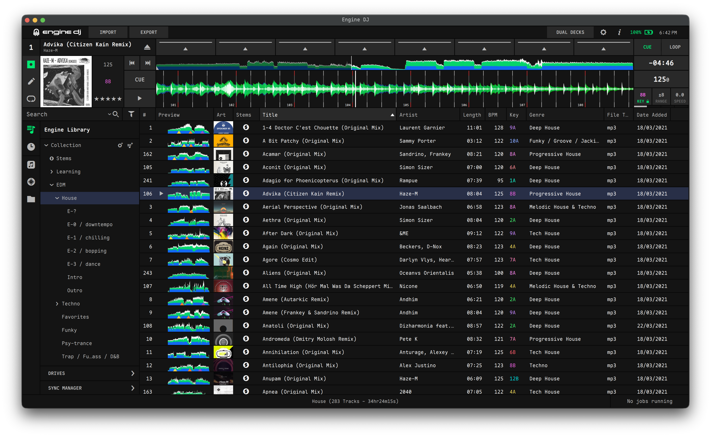
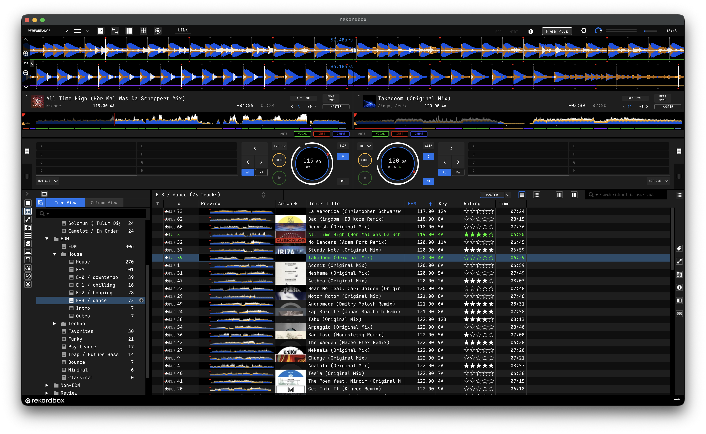

# better-fonts

`better-fonts` is a modular, configurable macOS command-line tool for patching and unpatching Electron and Native macOS applications to use custom fonts.





## What It Does

- **Dual-Driver Architecture**: Supports both **Electron** apps (via preload script CSS injection) and **Native Cocoa / Qt / C++** apps (via `DYLD_INTERPOSE` CoreText hooking).
- **Custom Font Injection**: Intercepts font creation and renders entire user interfaces in your chosen monospace or proportional font.
- **Bi-directional Patching & Unpatching**: Safely applies, replaces, or completely removes font patches without corrupting application bundles.
- **Native ASAR Engine**: Modifies Electron archive packages in-memory, preserving `.unpacked` native binaries (`.node`, `.dylib`, `.wasm`) without relying on external extraction tools.
- **Dynamic Native Hooking**: Compiles and injects lightweight CoreText interposition dylibs with native launcher wrappers on the fly.
- **Electron Fuses & macOS Codesigning**: Automatically disables `EnableEmbeddedAsarIntegrityValidation` fuses and re-signs modified `.app` bundles with ad-hoc signatures.
- **XDG Base Directory Compliance**: Stores user preferences in `$XDG_CONFIG_HOME/better-fonts/config.toml` (`~/.config/better-fonts/config.toml`).

## Supported Applications

`better-fonts` includes built-in support for:

| Application | Driver | Default Path | Method |
| :--- | :--- | :--- | :--- |
| **Paseo** | `electron` | `/Applications/Paseo.app` | Preload CSS (`dist/preload.js`) |
| **Signal** | `electron` | `/Applications/Signal.app` | Preload CSS (`preload.bundle.js`) |
| **Slack** | `electron` | `/Applications/Slack.app` | Preload CSS (`dist/preload.bundle.js`) |
| **Rekordbox** | `native-hook` | `/Applications/rekordbox 7/rekordbox.app` | CoreText Interposition |
| **Engine DJ** | `native-hook` | `/Applications/Engine DJ.app` | CoreText Interposition |
| **Telegram** | `native-hook` | `/Applications/Telegram.app` | CoreText Interposition |

*Custom applications can also be declared in `config.toml` or patched on demand.*

## How It Works

For everyday users, `better-fonts` makes font customization on macOS effortless and reversible:

1. **Detects the App Type**: Identifies whether the target application is built using web technology (like Slack, Signal, or Paseo) or as a native desktop program (like Rekordbox, Engine DJ, or Telegram).
2. **Injects Your Chosen Font**: Seamlessly instructs the application to render its text using your preferred font instead of the hardcoded system default.
3. **Safe and Reversible**: Makes changes in an isolated temporary staging area with automatic backups, allowing you to switch fonts at any time or restore the factory original with a single `better-fonts unpatch` command.

## How It Really Works

For developers and technical users, `better-fonts` operates via two distinct engine drivers tailored to macOS app architectures:

### 1. Electron Strategy (`electron`)

- **In-Memory ASAR Manipulation**: Parses the 16-byte header and JSON directory tree of the application's `app.asar` archive directly in Go. It locates the application preload script (such as `preload.bundle.js` or `dist/preload.js`), strips any existing patch markers, and injects a `DOMContentLoaded` event listener that attaches a global CSS style rule (`* { font-family: "<font>", monospace !important; }`). The ASAR is repacked in-place, preserving `.unpacked` native modules (`.node`, `.dylib`, `.wasm`) without needing to extract files to disk.
- **Pure Go Fuse Toggling**: Scans the `Electron Framework` Mach-O binary for the sentinel byte sequence `dL7pKGdnNz796PbbjQWNKmHXBZaB9tsX` and modifies the `EnableEmbeddedAsarIntegrityValidation` fuse wire byte directly to `'0'` (`DISABLE`), eliminating ASAR integrity checksum verification crashes without external Node.js dependencies.
- **Bundle Re-Signing**: Re-signs the modified bundle with an ad-hoc signature via `codesign --force --deep --sign -`.

### 2. Native CoreText Hook Strategy (`native-hook`)

- **CoreText Interposition (`DYLD_INTERPOSE`)**: Dynamically compiles an Objective-C library (`libfonthook.dylib`) using `clang` that interposes low-level macOS `CoreText` creation routines (`CTFontCreateWithName` and `CTFontCreateWithFontDescriptor`). When the target app requests fonts, the hook redirects the request to your configured font (with automatic variant mapping for Bold, Heavy, and Semibold weights) while explicitly passing through Apple private system fonts (prefixed with `.`) and symbol/emoji icon sets.
- **Launcher Binary Substitution**: Renames the original Mach-O executable to `<binary>.orig` and substitutes a compiled C wrapper launcher (`wrapper_launcher`). When executed by macOS, the launcher discovers its directory via `_NSGetExecutablePath`, sets `DYLD_INSERT_LIBRARIES=libfonthook.dylib`, and calls `execv` on the original binary, passing through all process arguments and environment variables.
- **Bundle Re-Signing**: Re-signs the modified `.app` bundle with `codesign --force --deep --sign -`.

## Prerequisites

- **macOS** (Apple Silicon or Intel)
- **[Xcode Command Line Tools](https://developer.apple.com/xcode/resources/) (`clang`)** — required when compiling native CoreText hooks (install with `xcode-select --install`)
- macOS built-in command-line utilities: [`codesign`](https://keith.github.io/xcode-man-pages/codesign.1.html), [`osascript`](https://keith.github.io/xcode-man-pages/osascript.1.html), [`open`](https://keith.github.io/xcode-man-pages/open.1.html), and [`plutil`](https://keith.github.io/xcode-man-pages/plutil.1.html)

*Note: `better-fonts` is completely self-contained with a native ASAR parser and native Electron fuse manipulator in Go. Node.js, Bun, and npm are **not** required.*

## Installation

Go to the [Latest Release Page](https://github.com/alexgorbatchev/better-fonts-cli/releases/latest) and download the pre-compiled archive for your operating system. Extract and move the binary to your `PATH`:

```bash
tar -xzf better-fonts_*.tar.gz
sudo mv better-fonts /usr/local/bin/
```

### From Source (Optional)

Ensure [Go 1.26+](https://go.dev/dl/) and [`just`](https://github.com/casey/just#installation) are installed:

```bash
git clone https://github.com/alexgorbatchev/better-fonts-cli.git
cd better-fonts-cli
just build
cp bin/better-fonts /usr/local/bin/
```

## Quick Start

### 1. Check Application Status

Inspect all supported applications to see if they are installed, which driver is used, whether they are patched, and what font is currently applied:

```bash
better-fonts status
```

Sample Output:
```
APP         DRIVER        INSTALLED   PATCHED   CURRENT FONT           PATH
---         ------        ---------   -------   ------------           ----
Paseo       electron      Yes         Yes       Maple Mono Normal NF   /Applications/Paseo.app
Signal      electron      Yes         Yes       SF Mono                /Applications/Signal.app
Slack       electron      Yes         Yes       Maple Mono Normal NF   /Applications/Slack.app
Rekordbox   native-hook   Yes         Yes       Maple Mono Normal NF   /Applications/rekordbox 7/rekordbox.app
Engine DJ   native-hook   Yes         Yes       Maple Mono Normal NF   /Applications/Engine DJ.app
Telegram    native-hook   Yes         No        -                      /Applications/Telegram.app
```

### 2. Patch Configured Applications

Patch all applications specified in `config.toml` (default is all supported apps):

```bash
better-fonts patch
```

### 3. Patch Specific Applications

Target one or more specific applications by name, ID, or `.app` bundle path:

```bash
better-fonts patch slack
better-fonts patch rekordbox engine-dj telegram
better-fonts patch /Applications/SomeCustomApp.app
```

### 4. Override Font from CLI

Apply a specific font without editing the configuration file:

```bash
better-fonts patch --font "JetBrains Mono" slack
better-fonts patch --font "Fira Code" telegram
```

### 5. Remove Font Patch (Unpatch)

Restore original preload scripts or executables across all or targeted applications:

```bash
better-fonts unpatch
better-fonts unpatch rekordbox
better-fonts unpatch /Applications/SomeCustomApp.app
```

### 7. Self-Upgrade

Check for and install the latest binary release directly from GitHub:

```bash
better-fonts upgrade
```

### 8. List Supported Applications

```bash
better-fonts list
```

## Configuration

`better-fonts` reads its configuration from `$XDG_CONFIG_HOME/better-fonts/config.toml` (defaults to `~/.config/better-fonts/config.toml`).

If the configuration file does not exist, running `better-fonts` creates a default one automatically.

### View Configuration Path & Contents

```bash
# Print configuration file location
better-fonts config path

# Display current configuration
better-fonts config show
```

### Sample `config.toml`

```toml
# Default font applied to patched applications
font = "Maple Mono Normal NF"

# Applications to patch by default.
# Use ["*"] for all supported apps, or list specific IDs: ["slack", "rekordbox", "telegram"]
apps = ["*"]

# Automatically restart applications after patching/unpatching
restart = true

# Per-application overrides
[apps_config.slack]
font = "JetBrains Mono"
restart = true

[apps_config.rekordbox]
font = "Maple Mono Normal NF"

# User-defined custom apps
[[custom_apps]]
id = "custom-electron"
name = "Custom Electron App"
path = "/Applications/CustomElectron.app"
driver = "electron"
process_name = "CustomElectron"
asar_path = "app.asar"
preload_path = "dist/preload.js"

[[custom_apps]]
id = "custom-native"
name = "Custom Native App"
path = "/Applications/CustomNative.app"
driver = "native-hook"
process_name = "CustomNative"
```

## Options & Flags

Global flags apply to all commands:

| Flag | Short | Default | Description |
| :--- | :--- | :--- | :--- |
| `--config` | `-c` | `~/.config/better-fonts/config.toml` | Custom path to configuration TOML file |
| `--font` | `-f` | *(from config)* | Override font name |
| `--app` | `-a` | *(from config)* | Target specific app(s) (e.g. `-a slack,rekordbox`) |
| `--restart` | | `true` | Restart application after patching or unpatching |
| `--no-restart` | | `false` | Prevent application restart after operations |
| `--dry-run` | | `false` | Simulate actions without modifying disk files |
| `--verbose` | `-v` | `false` | Enable verbose operational logging |
| `--version` | | | Print version string |

## Development

```bash
# Build binary into bin/better-fonts
just build

# Run CLI with arguments
just run status

# Run unit tests with race detection
just test

# Check code hygiene and run vet
just lint

# Clean build artifacts and temporary files
just clean
```

## License

This project is licensed under the [MIT License](LICENSE).
